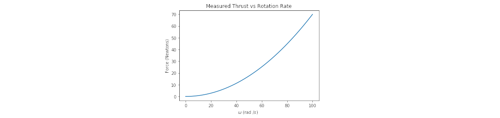
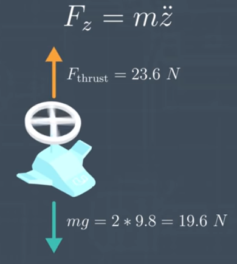

# AAE_021_CoaxialDrone
[Vehicle dynamics](https://en.wikipedia.org/wiki/Vehicle_dynamics) are concerned with the motion of bodies under the action of forces. For our purposes, vehicle dynamics references understanding how the rotatation of the quadrotor's four rotorss create forces and how these forces generate motion of the vehicle.

Over the next few notebooks, we'll learn how to model these motions, mathematically, in Python.

To understand the dynamics/motion of a quadrotor, we need to understand the forces that act upon the quadrotor. Namely, thrust, gravity, and drag.

For the following notebooks, we'll focus on the thrust generated by the quadrotor's rotors and the downward force of gravity (mass). In practice, we usually treat drag as a disturbance when designing quadrotor controllers and don't model it explicitly; as, the the effects are relatively small at lower vehicle and wind speeds and it's difficult to identify the correct drag model.

### Forces and Moments

Force is a vector; thus, when analysing force, we must know the size/magnitude of the vector, as well as the direction.

For gravity, the vector always points downward, toward the center of the Earth. The strength of the force is given by m * g where m is the mass of the quadrotor and g is the acceleration due to gravity (approximately 9.81 m/s^2).

The strength of the thrust vector depends on the size and shape of the rotor's blades and on how fast they are spinning. The direction of thrust is always perpendicular to the plane within which the rotor is spinning.

In order to stay airborne, the quadrotor must exert a force, with its rotors, at least equal that of the downward force of gravity -- creating a hover (translational equilibrium). (As with all forces, the size of these forces are measured in [Newtons](https://en.wikipedia.org/wiki/Newton_(unit))).

For the moment, let us consider a monorotor vehicle. If given a monorotor with a downward, gravitational force of 100 Newtons, what can be said about the value of F_thrust in order to keep the vehicle in a hover? F_thrust must, also, be 100 Newtons. What would be an expression for the mass of this vehicle? m = 100/9.81. (About 10.2 kg)

Even though hovering in a state of translational equilibrium, the monorotor cannot be in a state of rotational equilibrium. In addition to causing a thrust force, a rotating rotor also introduces what is called a moment or torque. A rotor that is rotating clockwise (CW) will produce a moment that causes the body to rotate counter-clockwise (CCW).

As is the case with helicopters and multirotors, a second rotor is introduced in order to cancel out this rotational force. (In the case of a helicopter, it is most often the tail rotor.) In looking at multicopters, you'll notice most to be designed with an even number of rotors (quad, hex, octo, etc). Each rotor spinning CW has its compliment rotor spinning CCW to negate rotation force (most often adjacent from one another).

The rotors that rotate CW introduce a CCW moment and the rotors that rotate CCW introduce a CW moment. If the CW rotors are spinning faster than the CCW rotors, then the CCW moments produced by those rotors will dominate and the vehicle will yaw in the CCW direction. But, at what rate will it yaw; what are the magnitudes of the moments and forces that the rotating rotors produce?

We use the lowercase, greek letter omega(ω) to represent the rotation rate of a motor and this rate is measured in units of rad/s. (So, when ω = π, the rotor is completing one rotation/second.)

It turns out that, when a rotor is rotating with a rotational rate omega, the thrust produced and the induced moment are both proportional to omega^2. The constant of proportionality we call K sub f for force and K sub m for moment. The actual value of these constants depend on the size and shape of the blades, the specific motors used, as well as the density of the surrounding air that they operate in. (In practice, we usually obtain these values empirically.)

Based on the Force vs omega graph shown above, what is k_sub_f for this propeller? 0.007. If you double the rotation speed of the rotor, how does the thrust change? It increases by a factor of 4.

### Unbalanced Forces (F = ma)

Returning to the monorotor for a moment, what happens when F_thrust > mg? ... The monorotor moves up with constant acceleration.

Unbalanced forces cause acceleration. When an object experiences an unbalanced force, it accelerates in the direction of the net force. So, if F_thrust is greater than the weight/mass of the object, there will be an upward acceleration.

The mathematical relationship between force and acceleration is F=ma. F is the net force on the object. The acceleration is measured in the inertial frame -- that is, a reference frame that is not accelerating, like the world frame introduced earlier.

In general, F and a are vectors and have magnitude and direction; but, these vectors can be analysed on a per-direction basis. So, looking in the verticle direction the z-component of force will cause and acceleration in the z-direction. Since acceleration is the second derivative of position, we can say that Fz = m𝑧¨.

So, if a monorotor with a mass of 2kg has these forces acting on it, then the net force would be 23.6 - 19.6N or 4 Newtons and this would cause an acceleration of 2 m/s^2 for this vehicle.

What thrust would a 2.2kg monorotor need in order to accelerate upwards at -4.0 m/s^2 (remember, z is positive downward)? 30.4N.

### Unbalanced Moments Cause Rotational Acceleration

Just like unbalanced forces cause translational acceleration, unbalance moments cause rotational acceleration and the equation is give as: τ = Iα. That is to say that the net torque = (moment of inertia)(angular acceleration) wherein I is measured in (kg)(m^2) and angular acceleration is measured in radians/s^2.

Remember that a quadrotor can roll around its x-axis, pitch around its y-axis, and yaw around its z-axis and, in general, the moment of inertia can be different for each of these axes. Later, we'll see that, to describe the 3D quadrotor motions, the moment of inertia will be a 3x3 matrix and torqu and alpha are vectors.

For the purpose of this demonstration, we'll only be thinking about one axis of rotation at a time. For the monorotor example, we'll only be considering yaw about the z-axis; so, we only need to pay attention to Iz and alpha and torque are scalar values.

In the world of quadrotor dynamics, people tend to use the word 'moment' over 'torque' and usually use the greek letter psi (Ψ) to represent yaw. Thus, another way way to write this equation is Mz = Iz𝜓¨ (M-zed is equal to I-zed times psi double-dot) -- this is another way to say "the moment about the z-axis will cause an acceleration in the psi coordinate".

In the next few sections, the model we'll be using is a coaxial helicopter. Which is just a body with two rotors on top of each other. These rotors both produce upward thrust, but they do so by spinning in opposite directions to counter-balance the net torque about the z-axis (that is, to control the yaw of the model).

Looking at the "flying car" shown above, we notice it is coaxial. If rotor 1 (top) spins faster than rotor 2, in which direction will the body of the vehicle experience angular acceleration? ... Counter-clockwise (CCW).

Consider a coaxial copter with the above quantities (all given in standard units). What will be the resulting linear acceleration z_double_dot? What about rotational acceleration psi_double_dot?

z_double_dot = -6.6 m/s^2

psi_double_dot = -3.6 rad/s^2

